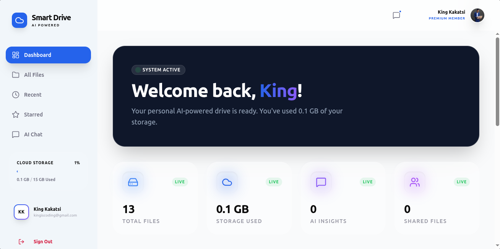
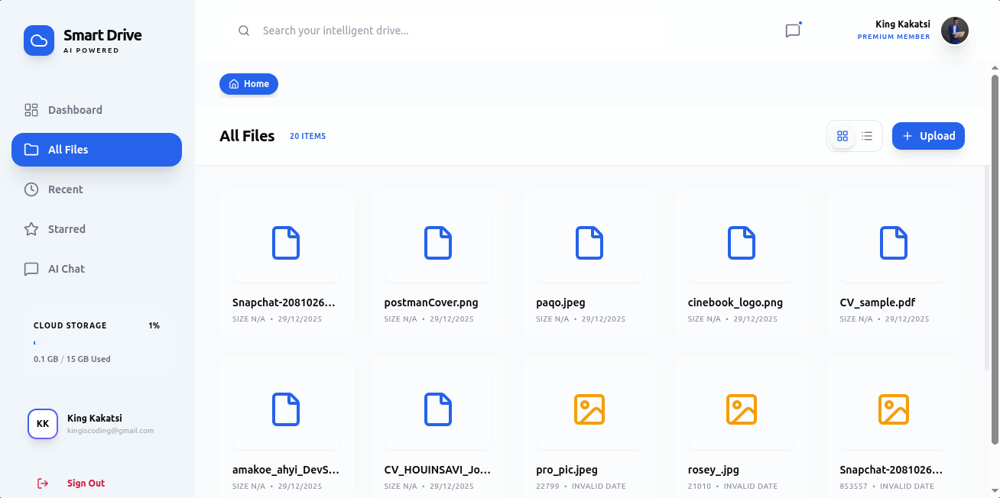
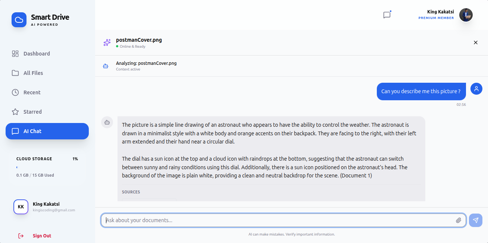

# Smart-Drive

**Smart-Drive** is an AI-powered document and video analysis platform with Google Drive integration. Ask questions about your files and get intelligent answers using Groq AI. Built with Vue.js frontend and FastAPI backend, it provides seamless document analysis, video transcription, and real-time AI conversations.

## Overview

Smart-Drive transforms how you interact with your documents and videos by combining powerful AI analysis with intuitive file management. Whether you're researching academic papers, analyzing business documents, or exploring video content, Smart-Drive delivers intelligent answers based on your actual files.

### Why Smart-Drive?

- **AI-Powered Analysis**: Get intelligent answers from documents and videos using advanced RAG (Retrieval-Augmented Generation)
- **Google Drive Integration**: Seamlessly connect and sync your Google Drive files
- **Video Transcription**: Automatic speech-to-text with timestamp preservation
- **Multi-format Support**: Process PDFs, DOCX, videos, images, and more
- **Real-time Chat**: WebSocket-powered streaming AI conversations
- **Vector Search**: Fast, semantic search across all your content
- **Local Processing**: Zero-cost processing with local AI models
- **Modern UI**: Clean, responsive Vue.js interface with TailwindCSS

## Key Features

### AI Assistant (Core Feature)
- **Document Analysis**: Extract and understand text from PDFs, DOCX, TXT files
- **Video Analysis**: Whisper-powered transcription with timestamped Q&A
- **Intelligent Q&A**: Ask contextual questions about your content
- **Source Citations**: Every answer includes file references and locations
- **Multi-file Queries**: Analyze multiple files simultaneously
- **Streaming Responses**: Real-time AI responses via WebSocket

### File Management System
- **Google Drive Sync**: Automatic synchronization with Google Drive
- **Local Upload**: Drag-and-drop file uploads with progress tracking
- **File Explorer**: Intuitive file browser with preview capabilities
- **Multi-format Support**: Support for documents, videos, images, and audio
- **Smart Organization**: Automatic file categorization and metadata extraction

### Advanced AI Features
- **Vector Embeddings**: ChromaDB-powered semantic search
- **Chunking Strategy**: Intelligent text chunking with overlap
- **Context-Aware**: Responses based only on your indexed content
- **Timestamp Queries**: Ask "What happens at 1:30?" in videos
- **Cross-File Analysis**: Compare and analyze multiple documents

## Screenshots

### Dashboard Overview


### File Explorer


### AI Chat Interface


## Technology Stack

### Frontend
- **Framework**: Vue 3 + Composition API
- **Build Tool**: Vite
- **Styling**: TailwindCSS
- **State Management**: Pinia
- **Routing**: Vue Router
- **HTTP Client**: Axios

### Backend
- **Framework**: FastAPI
- **Language**: Python 3.12
- **Real-time**: WebSockets
- **Authentication**: JWT
- **Database**: SQLite + ChromaDB
- **AI**: Groq API + Whisper

### AI & Data Processing
- **LLM**: Groq API (OpenAI-compatible)
- **Vector DB**: ChromaDB (local)
- **Speech-to-Text**: Whisper (local)
- **Embeddings**: Sentence transformers
- **Document Processing**: PyPDF2, python-docx

### External Integrations
- **Google Drive**: Google Drive API v3
- **OAuth2**: Google OAuth2 flow
- **Authentication**: JWT tokens

### Infrastructure
- **Containerization**: Docker + Docker Compose
- **Web Server**: Nginx (production)
- **Reverse Proxy**: Nginx
- **Development**: Hot reload for both frontend and backend

## Quick Links

- [Installation Guide](./docs/INSTALLATION.md)
- [Quick Start](./docs/QUICKSTART.md)
- [Architecture Overview](./docs/ARCHITECTURE.md)
- [Configuration Guide](./docs/CONFIGURATION.md)
- [API Reference](./docs/API_REFERENCE.md)
- [Security Guide](./docs/SECURITY.md)
- [Deployment Guide](./docs/DEPLOYMENT.md)
- [Contributing](./docs/CONTRIBUTING.md)

## Getting Started

### Prerequisites

- Python 3.12 or higher
- Node.js 20.x or higher
- Docker & Docker Compose (recommended)
- Google Drive API credentials
- Groq API key

### Quick Start

```bash
# Clone the repository
git clone https://github.com/king-kakatsi/smart-drive.git
# Or using SSH:
# git clone git@github.com:king-kakatsi/smart-drive.git
cd smart-drive

# Install dependencies
make setup

# Configure environment
cp backend/.env.example backend/.env
# Edit .env with your API keys

# Start development servers
make dev

# Access the application
# Frontend: http://localhost:5173
# Backend API: http://localhost:8000
# API Docs: http://localhost:8000/docs
```

For detailed setup instructions, see [INSTALLATION.md](./docs/INSTALLATION.md)

## Usage Examples

### Document Analysis
```
User: "What are the key findings in the research paper?"
AI: "According to the paper 'Machine Learning Advances' (page 15), the key findings include:
- Neural networks achieved 94% accuracy on benchmark datasets
- Transfer learning reduced training time by 60%
- The proposed architecture outperformed existing models by 12%"
```

### Video Q&A
```
User: "What happens at 2:30 in the tutorial video?"
AI: "At timestamp 2:30 in 'Python Tutorial.mp4', the instructor demonstrates:
- How to create virtual environments using venv
- Installing packages with pip
- Activating the environment on different operating systems"
```

### Cross-File Analysis
```
User: "Compare the pricing models in these two documents"
AI: "Based on 'Company A Proposal.pdf' and 'Company B Contract.docx':
- Company A: $50/user/month with annual billing discount
- Company B: $75/user/month with no long-term commitments
- Company A offers better value for organizations with 50+ users"
```

## Architecture Overview

Smart-Drive follows a modern microservices-inspired architecture with clear separation of concerns:

### System Architecture



### High-Level Flow

```
┌─────────────────┐    WebSocket    ┌─────────────────┐
│   Vue 3 UI      │◄──────────────► │ FastAPI Backend │
│   (Frontend)    │    HTTP/REST    │   (Backend)     │
└─────────────────┘                 └─────────────────┘
```

## Development Workflow

### Running the Application

```bash
# Start all services with Docker
docker-compose -f docker/docker-compose.yml up --build

# Or run development servers manually
make dev-backend  # Terminal 1
make dev-frontend # Terminal 2
```

### Code Style

- **Backend**: Black formatting, isort imports, flake8 linting
- **Frontend**: ESLint, Prettier formatting
- **Commits**: Angular commit convention
- **Documentation**: Clear, concise, and comprehensive

### Testing

```bash
# Backend tests
cd backend && python -m pytest

# Frontend tests
cd frontend && npm run test

# End-to-end tests
npm run test:e2e
```

## Configuration

Smart-Drive uses environment-based configuration for security and flexibility:

```bash
# Essential configuration
GOOGLE_CLIENT_ID=your-google-client-id
GOOGLE_CLIENT_SECRET=your-google-client-secret
GROQ_API_KEY=your-groq-api-key
SECRET_KEY=your-jwt-secret-key

# Optional configuration
DEBUG=true
DATABASE_URL=sqlite:///./smart_drive.db
ALLOWED_ORIGINS=http://localhost:5173,http://localhost:3000
```

For complete configuration options, see [CONFIGURATION.md](./docs/CONFIGURATION.md)

## API Overview

Smart-Drive provides REST APIs and WebSocket connections:

### REST Endpoints
- `POST /auth/login` - User authentication
- `GET /files` - List user files
- `POST /files/upload` - Upload files
- `POST /drive/connect` - Connect Google Drive
- `WebSocket /ws/chat` - Real-time AI chat

### WebSocket Protocol
```javascript
// Connect to chat
const ws = new WebSocket('ws://localhost:8000/ws/chat');

// Send message
ws.send(JSON.stringify({
  message: "What are the main topics?",
  file_ids: ["file1", "file2"]
}));

// Receive streaming response
ws.onmessage = (event) => {
  const data = JSON.parse(event.data);
  console.log(data.content); // Streaming content
};
```

For complete API documentation, see [API_REFERENCE.md](./docs/API_REFERENCE.md)

## Security Features

- **JWT Authentication**: Secure token-based authentication
- **OAuth2 Integration**: Secure Google Drive authorization
- **File Validation**: Comprehensive upload validation
- **Rate Limiting**: API request throttling
- **HTTPS Only**: Encrypted communications in production
- **Secure Storage**: Encrypted token storage

For detailed security information, see [SECURITY.md](./docs/SECURITY.md)

## Deployment

### Development
```bash
# Quick development setup
docker-compose -f docker/docker-compose.yml up --build
```

### Production
```bash
# Production deployment
docker-compose -f docker/docker-compose.prod.yml up -d

# With SSL
docker-compose -f docker/docker-compose.ssl.yml up -d
```

For complete deployment guides, see [DEPLOYMENT.md](./docs/DEPLOYMENT.md)

## Contributing

We welcome contributions! Please see [CONTRIBUTING.md](./docs/CONTRIBUTING.md) for guidelines.

### Development Setup
1. Fork the repository
2. Create a feature branch: `git checkout -b feature/your-feature`
3. Make your changes with tests
4. Run tests: `make test`
5. Submit a pull request

## Built by

### Leroi Kakatsi
- **Email**: leroi.kakatsi@epitech.eu
- **WhatsApp**: [+233 53 561 0908](https://wa.me/233535610908)
- **Portfolio**: [king-kakatsi.netlify.app](https://king-kakatsi.netlify.app)

## Resources

- [Vue.js Documentation](https://vuejs.org/)
- [FastAPI Documentation](https://fastapi.tiangolo.com/)
- [ChromaDB Documentation](https://docs.trychroma.com/)
- [Google Drive API](https://developers.google.com/drive/api)
- [Groq API Documentation](https://console.groq.com/docs/)

## License

This project is licensed under the MIT License - see the [LICENSE](LICENSE) file for details.

## Acknowledgments

- **OpenAI** for Whisper and ChromaDB examples
- **Google** for Drive API documentation and samples
- **LangChain** community for AI integration tutorials
- **Vue.js** ecosystem for excellent UI components
- **FastAPI** team for the amazing web framework
- **ChromaDB** for the vector database solution