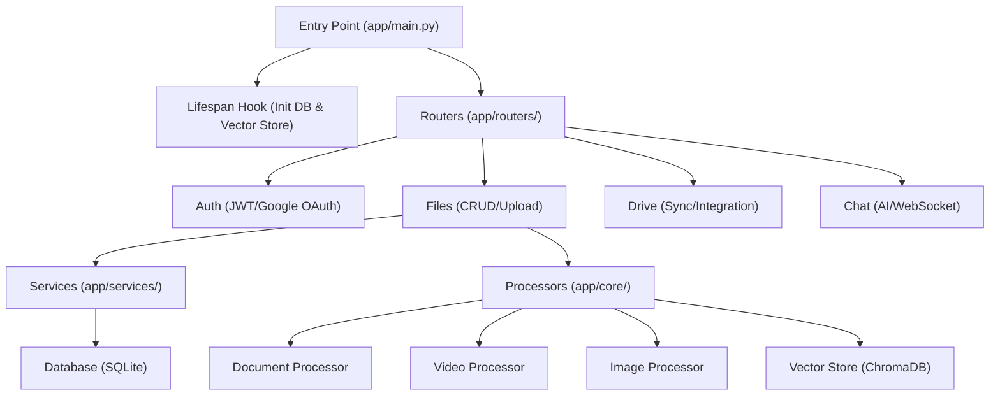

# Smart-Drive Backend Architecture

A deep dive into the structure, data flow, and technology choices of the Smart-Drive backend.

## Overview
The backend is built with **FastAPI**, a high-performance Python web framework, designed to handle asynchronous file processing and real-time AI interactions. It follows a modular architecture that separates API routing, business logic, and core infrastructure clients.

## High-Level Structure

## Data Flow: The Upload Journey
1.  **Entry**: A file is uploaded via `/api/v1/drive/upload` or `/api/v1/files/upload`.
2.  **Metadata Persistence**: The `save_file_metadata` service writes record details (filename, file_type, folder_path) to **SQLite**.
3.  **Physical Storage**: The file is saved locally in the `uploads/` directory.
4.  **Background Processing**: A FastAPI `BackgroundTask` is triggered based on the file type:
    - **Documents**: Text is extracted using `PyPDF2` or `python-docx`.
    - **Videos**: Audio is extracted and transcribed via **OpenAI Whisper**.
    - **Images**: Content is analyzed via OCR or image description models.
5.  **Vectorization**: Extracted text is split into chunks and sent to the **Vector Store (ChromaDB)**. This enables semantic search and "Chat with your files" features later.

## Storage Strategy: Why Three Layers?
Smart-Drive uses a hybrid storage approach to maximize performance and AI capabilities:

| Storage Type | Technology | Purpose | Why? |
| :--- | :--- | :--- | :--- |
| **Relational** | SQLite (via SQLAlchemy) | Metadata, Users, Tokens, Chat History | Efficient indexing and structured queries. |
| **Vector** | ChromaDB | Document Embeddings | Enables LLMs to perform "Retrieval Augmented Generation" (RAG). |
| **File System** | Local `uploads/` | Physical binary files | High speed for internal processing and avoids database bloat. |

## Technology Stack & Rationale
-   **FastAPI**: Used for its native support for `async/await`, which is critical when waiting for AI responses or file I/O.
-   **SQLAlchemy (Async)**: Provides a robust ORM layer that works harmoniously with FastAPI's asynchronous nature.
-   **Groq/OpenAI**: State-of-the-art LLMs used for generating intelligent insights and chat responses.
-   **OpenAI Whisper**: High-accuracy speech-to-text for transcribing video content into searchable text.
-   **ChromaDB**: A lightweight, native vector database that allows the application to scale its AI knowledge base without complex infrastructure.

## Why this Architecture?
This design adheres to the **Separation of Concerns** principle:
-   **Routers** only handle HTTP concerns (request validation, status codes).
-   **Services** encapsulate business logic and database interactions.
-   **Core** modules manage third-party integrations (Google Drive, AI providers).
-   **Processors** handle the heavy lifting of unstructured data conversion.
