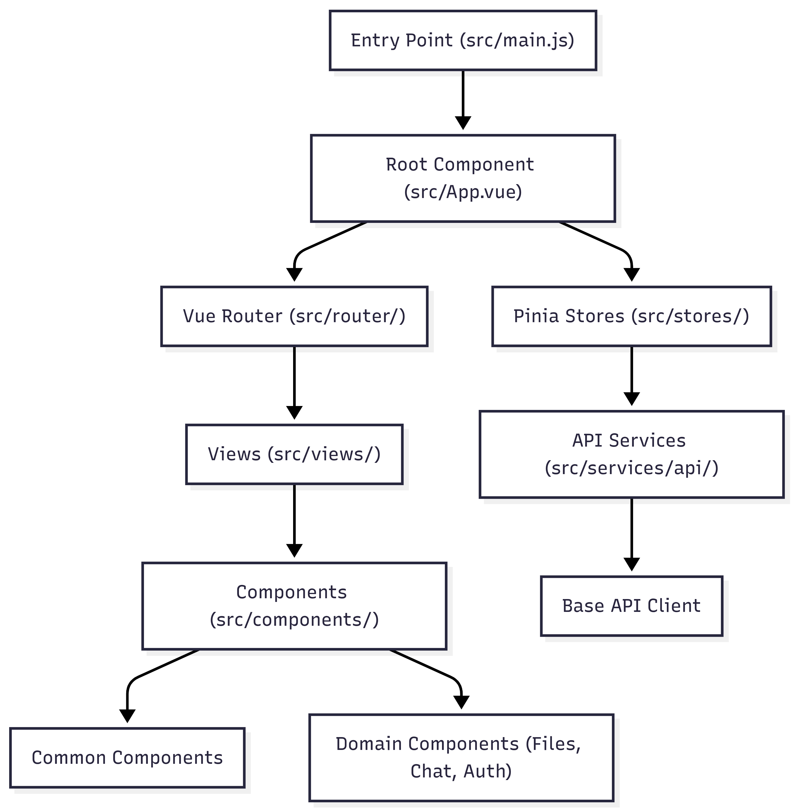
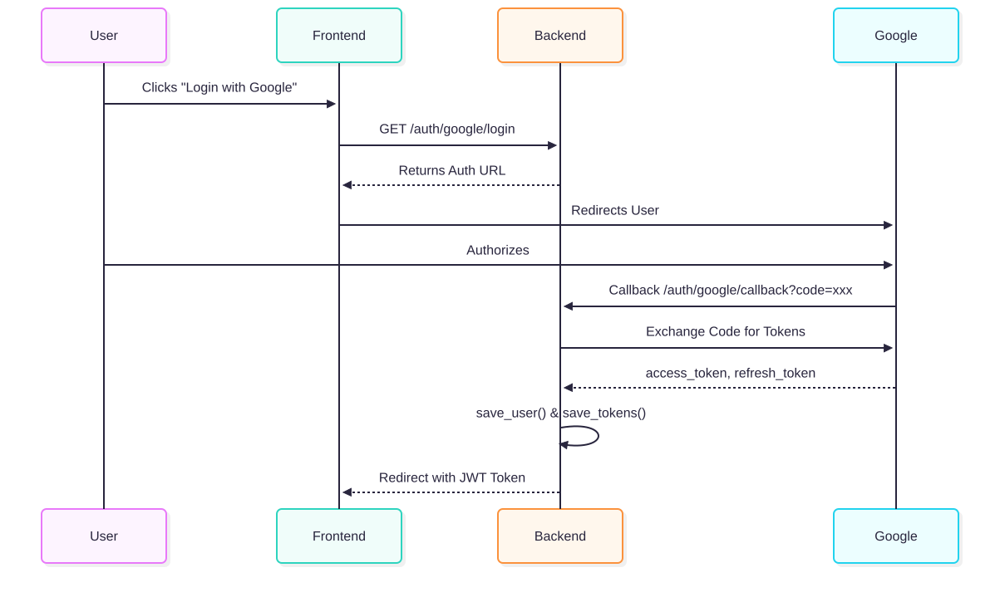

# Smart-Drive Frontend Architecture

A detailed overview of the technologies, structure, and design principles of the Smart-Drive frontend application.

## Overview
The frontend is a modern, reactive single-page application (SPA) built with **Vue 3** and **Vite**. It is designed for speed, visual excellence, and a seamless user experience, utilizing a component-based architecture and centralized state management.

## High-Level Structure

*Detailed Frontend Component and State Flow*

### System Sequence Diagram

## Technology Stack
- **Framework**: **Vue 3 (Composition API)** for a reactive and maintainable UI.
- **Build Tool**: **Vite** for lightning-fast development and optimized production builds.
- **State Management**: **Pinia** for scalable, modular state across the application.
- **Styling**: **Tailwind CSS** for a utility-first, highly customizable design system.
- **Icons**: **Lucide Vue Next** for a consistent and modern iconography set.
- **Routing**: **Vue Router** for complex navigation and protected routes.

## Core Architectural Pillars

### 1. Modular State Management (Pinia)
The application state is divided into logical "stores" to keep the logic clean and predictable:
- **Auth Store**: Manages user session, Google OAuth flow, and profile data.
- **Files Store**: Handles file listing, folder navigation, uploads, and deletions.
- **Chat Store**: Manages AI conversation history and WebSocket streaming states.

### 2. Centralized API Layer
All communication with the backend is abstracted into a service layer:
- **ApiClient**: A singleton that handles base URLs, JWT token injection from `localStorage`, and error handling for all `fetch` requests.
- **Domain Services**: Specialized services (e.g., `fileService`, `driveService`) that map API endpoints to reusable JavaScript functions.

### 3. Component-Based UI
The UI is built with a clear hierarchy:
- **Views**: Top-level page components (e.g., `FileExplorer.vue`, `Dashboard.vue`) that map directly to routes.
- **Domain Components**: Feature-specific UI elements (e.g., `FileCard.vue`, `UploadModal.vue`).
- **Common Components**: Reusable UI atoms like `BaseButton`, `Dropdown`, and `Badge`.

### 4. Real-time Interactions
The AI Chat feature utilizes **WebSockets** for real-time, streaming responses, providing a fast and interactive "ChatGPT-like" experience for document analysis.

## Design Philosophy
The application prioritizes **Visual Excellence**:
- **Glassmorphism**: Use of `backdrop-blur` and semi-transparent backgrounds for a premium, airy feel.
- **Micro-animations**: Subtle transitions and hover effects to make the interface feel alive.
- **Responsive Layout**: Designed to work seamlessly across desktops, tablets, and mobile devices.
- **Consistent Tokens**: Centralized variables for colors, spacing, and typography.
